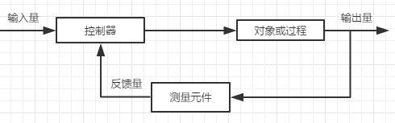
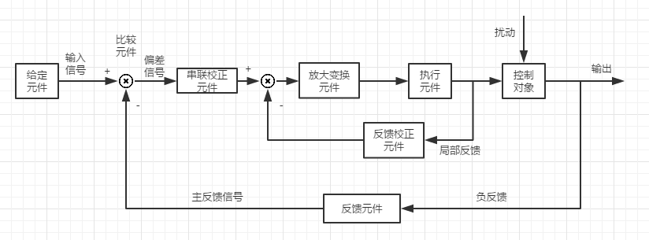
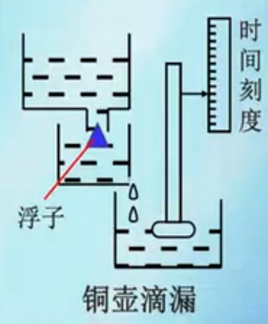

# ***<u>自动控制系统的基本概念</u>***

无人的情况下，利用外加设备（控制器），使机器、设备或生产过程（被控对象）的某些工作状态或参数（被控量）自动地按照预定的规律运行(输出)。

* 参考输入量（信号）
* 系统输出量（被控量）
* 反馈信号（输出通过测量装置返回输入端，与输入量比较，产生偏差信号。这个过程叫反馈,返回的全部或部分输出信号为反馈信号）

***

1. 检测输出量（被控量）的实际值
2. 将输出量的实际值与给定值（输入量）进行比较得出偏差
3. 用偏差值产生控制调节作用消除偏差，使输出维持期望水平

 由于输出反馈，系统可以自动减少输出与参考输入的偏差，此为反馈控制。

显然：

​			反馈控制建立在偏差基础上，其控制方式是“检测偏差再纠正偏差”.

反馈控制系统三个基本功能：

​			测量、比较、执行。

***注意:***

​			反馈与期望相减，使偏差越来越小，为负反馈。负反馈是实现自动控制最基本的方法。

***

* 开环控制

	* 无反馈，简单

* 闭环控制 

  * 从输出端反馈
  
  * 降低了对前向通道（从给定值到被控量的通道）精度的要求
  
  * 麻烦
  
  * 洗澡，来回调冷热水，震荡
  
    
  
	
	  
  
    * 恒值控制系统
  
      ​            期望为稳定值
  
  * 随动系统（伺服系统）
  
    ​		输入量的变化规律未知，其控制要求是输出量迅速、平稳地跟随输入量的变化，并能排除各种干扰因素的影响，准确浮现输入信号的变化规律。（导弹打飞机）
  
  * 连续控制系统
  
    ​		传递信号为随时间连续变化的信号。连续控制系统通常用微分方程描述。
  
  * 离散（数字）控制系统
  
    ​		系统中一处或多处信号为冒充序列或数字量传递的系统。离散控制系统通常用差分方程描述。
  
  * 线性系统和非线性系统
  
  * 定常系统和时变系统
  
* 对控制系统的基本要求

   * 稳定性

     ​		系统动态过程的振荡倾向及其恢复平衡状态的能力。由系统结构决定，与外界因素无关。

  * 精确性（稳态误差）

    ​		系统的调整（过度）过程结束而趋于稳定状态时，系统输入量的实际值与给定量的差值。

  * 快速性

    ​		

* 半闭环控制系统

  * 反馈信号通过系统内部的中间信号获得，

# ***<u>控制工程的发展</u>***

* 公元前1400年~1100年，中国、埃及、巴比伦相机出现自动计时漏壶，人类产生了最早期的控制思想。

  ​		

  ​		浮子为反馈

* 公园1788年，英国人J·Watt用离心式调速器控制蒸汽机的速度，由此产生了第一次工业革命。

  ​		

* 1868年：J.C.Maxwell发表《调速器》，提出反馈控制的概念及稳定性条件.

* 1884年：E.J.Routh提出劳斯稳定判据.

* 1892年：A.M.Lyapunov提出李雅普诺夫稳定性理论.

* 1895年：A.Hurwitz提出赫尔维兹稳定性判据.

* 1932年：H.Nyquist提出奈奎斯特稳定性判据.

* 1945年：Bode提出反馈放大器的一般设计方法.

* 1848年：N.Wiener发表《控制论》，标志经典控制理论基本成型；经典控制理论以传递函数为基础，主要研究输入——单输出(SISO)系统的分析和控制问题.

* 1950年：W.R.Evans提出根轨迹法，进一步充实了经典控制理论.

* 1954年：钱学森用英文出版《工程控制论》，首先把控制论推广到工程技术领域.

* 509年代末60年代初：现代控制理论形成.

  ​		主要分析和研究多输入-多输出（MIMO）、时变、非线性等系统的最优控制、最优滤波、系统辨识、自适应控制、智能控制等问题.

  ​		控制理论研究的重点开始由频域移到从本质上来说是时域的状态空间方法.

* 1956年：庞特里亚金提出极大值原理.

* 1957年：R.I.Bellman提出动态规划理论.

* 1960年：R.E.Kalman提出卡尔曼滤波理论.

* 1960年~1980年：确定性系统的最优控制、随机系统的最优控制、复杂系统的自适应和自学习控制.

* 1980迄今：鲁棒控制、H∞ $H\infty$ 控制、非线性控制、智能控制等.

# ***<u>控制理论在机械制造工业中的应用</u>***

略

