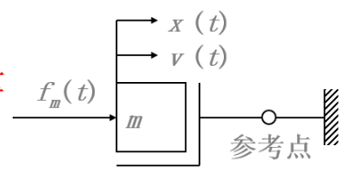
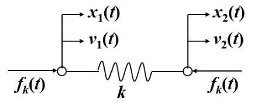
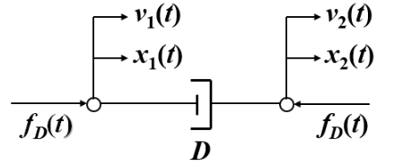
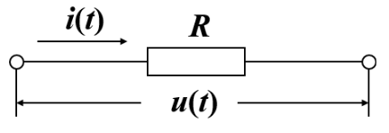
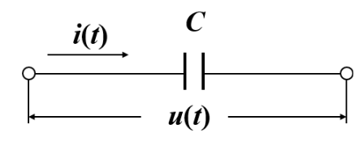
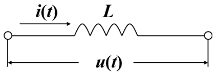

---

---

# ***<u>基本环节数学模型</u>***

* 系统的数学模型

  数学模型是描述系统输入、输出量以及内部各变量之间的关系的数学表达式，揭示了系统结构及其参数与性能之间的内在关系。

  * 静态数学模型

    静态条件（变量各阶导数为零）下描述变量之间关系的代数方程。反应系统处于稳态时，系统状态有关属性变量之间关系的数学模型。

  * 动态数学模型：

    描述变量各阶导数之间关系的微分方程。描述动态系统瞬态与过渡态特性的模型。动态系统的输出信号不仅取决于同时刻的激励信号，而且与它过去的工作状态有关。微分方程或差分方程常用作动态数学模型。

    对于给定的动态系统，数学模型表达不唯一。常用：微分方程、传递函数和状态方程。对于线性系统。他们等价。

* 建立数学模型的方法

  * 解析法

    依据系统及元件间隔变量之间所遵循的物理规律列写出相应的数学关系式，建立模型。

  * 实验法

    人为地对系统施加某种测试信号，记录其输出响应，并用适当的数学模型进行逼近。也称为系统辨识。

    数学模型应能反应系统内在的本质特征，同时应对模型的简洁性和精确性进行折中考虑。

* 数学模型的形式

  * 时间域

    微分方程

    差分方程

    状态方程（一阶微分方程组）

  * 复数域

    传递函数

    结构图

  * 频率域

    频率特性
  
* 控制系统微分方程的列写
  
 * 机械系统
  
     机械系统中各种形式出现的物理现象，都可以简化成质量，弹簧和阻尼这仨各要素:
  
     * 质量
     
        

		$$
		f_m(t)=ma(t)=m\frac{d}{dt}v(t)=m\frac{d^2}{dt^2}x(t)
		$$
	
	* 弹簧
	
	  
	  $$
	  f_k(t)=k[x_1(t)-x_2(t)]=kx(t)
	  $$
	
	* 阻尼
	
	  
	  $$
	  \begin{align}
	  f_D&=D[v_1-v_2(t)]=Dv(t)\\
	  &=D(\frac{dx_1(t)}{dt}-\frac{dx_2(t)}{dt})\\
	  &=D\frac{dx(t)}{dt}  
	  \end{align}
	  $$
	  

* 电路系统

  电路系统三个基本元件：电阻、电容、电感

  * 电阻

    
    $$
    u(t)=R\cdot i(t)
    $$

  * 电容

    
    $$
    u(t)=\frac{1}{c}\int i(t)d(t)
    $$

  * 电感

    
    $$
    u(t)=L\frac{di(t)}{dt}
    $$

* 建立数学模型的一般步骤
  * 分析系统工作原理和型号传递变换的过程，确定系统和各元件的输入、输出变量
  * 从输入端开始，按照信号传递变换过程，依据各变量遵循的物理学定律，依次写出各个元件、部件的动态微分方程
  * 消去中间变量，得到描述元件或系统输入、输出变量之间关系的微分方程
  * 标准化：右端输入，左端输出，导数降幂排列

* 小结
  * 物理本质不同的系统，可以有相同的数学模型，可以抛开系统的物理属性，用同一种方法进行具有普遍意义的分析研究
  * 从动态性能看，在相同形式的输入作用下，数学模型相同而物理本质不同的系统其输出响应相似。相似系统是控制理论中进行试验模拟的基础。
  * 通常情况下，元件或系统微分方程的阶次等于元件或系统中所包含的独立储能元件（惯性质量，弹性要素，电感，电容）的个数；因为系统每增加一个独立储能元件，其内部就多一层能量交换。
  * 系统的动态特性是系统的固有特性，仅取决于系统的结构及其参数，与系统的输入无关

[返回自动控制原理目录](./pac.md)

